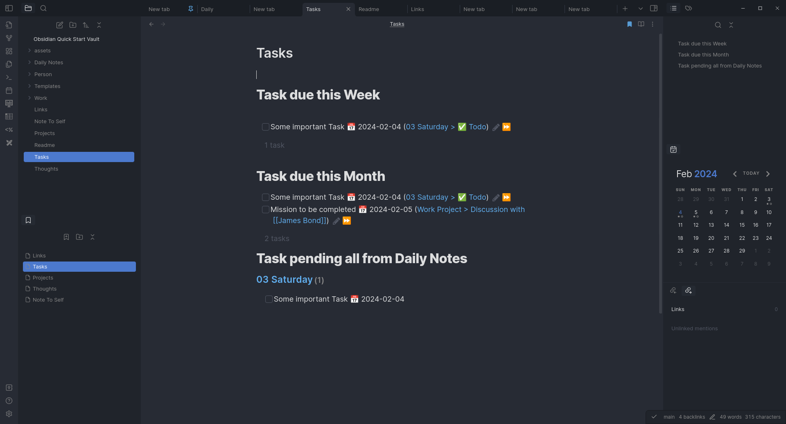
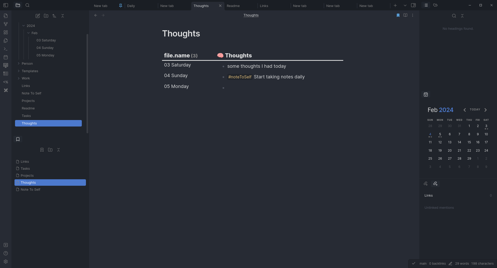

# Obsidian Quick Start Notes

A Quick start note taking template for Obsidian

- You can fork 🍴 this repository and start using it 
- Remember to make fork private ❗
- Pull requests with new feature are welcomed 👼🏻

# Screenshots

## Daily Notes

## Tasks

## Sub sections from Daily Notes
 

## Projects

## Graph so far

# Main Community Plugins used

- obsidian-advanced-slides
- table-editor-obsidian
- calendar
- dataview
- obsidian-dictionary-plugin
- cm-editor-syntax-highlight-obsidian
- obsidian-excalidraw-plugin
- obsidian-icon-folder
- url-into-selection
- obsidian-mind-map
- obsidian-tasks-plugin
- obsidian-git
- obsidian-pandoc
- templater-obsidian

# Templates

Modify templates  as per your taste 😋

## [[Templates/Daily|Daily Notes]]

- template for daily note
- Create Daily notes using calendar or Daily Notes button
- write in different section as needed
## [[Templates/Project|Project]]

- Use this template for creating Project Notes
- [[Templates/Project#Action Item]] 
	- Section gets populated automatically using `Dataview` plugin when you create any `- [ ]` task in the file  
	- It only shows incomplete task in the section
- [[Templates/Project#Discussions]]
	- Use this section for maintaining discussions using [[Templates/Discussion header|Discussion header]] template
## [[Templates/Discussion header|Discussion header]]

- Creates Sub heading and discussion tag with date of creation
- this tag is then referred in [[Templates/Daily|Daily Note]] of that day, this way all the discussion of the day get linked at one place
- Use [[Templates/Discussion meta|Discussion meta]] for creating additional tags if discussion happens again with same set of people

## [[Templates/Person Info|Person Info]]

- To list details related to person
- mention person in notes as you create, this will help in grouping all the conversation with that person
- From Book [How to talk to anyone](https://www.goodreads.com/en/book/show/35210)
	> **Technique #76: the business card dossier**
		- Right after you talk to someone at a party, write down notes to remind you details of the conversation
